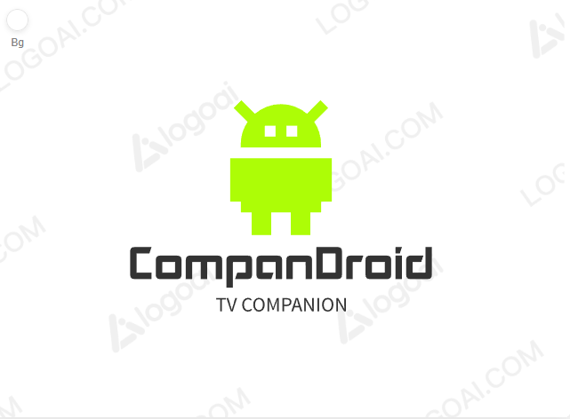

# ATVCompanion

A small Windows app + CLI that lets you **wake**, **pair/auth**, and **put in standby** Android TVs from supported manufacturers.  
Originally built for **Philips JointSPACE v6**, the app now supports a **manufacturer drop-down** and a pluggable backend (Philips, Sony, …).

> ✅ **Current milestone:**  
> • UI pairs/authenticates successfully for supported brands  
> • Wake-on-LAN works  
> • Standby works  
> • Config is persisted and reused across runs (UI & CLI share it)  
> ⚠️ **“Create Tasks”** (Windows Task Scheduler helper) exists but is still being finalized.

---

## Table of Contents

* [Features](#features)
* [Supported TVs](#supported-tvs)
* [Repository Layout](#repository-layout)
* [Requirements](#requirements)
* [Build](#build)
* [Run](#run)
  * [UI](#ui-recommended)
  * [CLI](#cli)
* [Configuration](#configuration)
* [Scheduled Tasks (WIP)](#scheduled-tasks-work-in-progress)
* [Troubleshooting](#troubleshooting)
* [Security & Privacy](#security--privacy)
* [Roadmap](#roadmap)
* [Contributing](#contributing)
* [License](#license)
* [Acknowledgements](#acknowledgements)

---

## Features

* **Multi-brand architecture** with a **Manufacturer** selector in the UI (pluggable backends)
  * **Philips (JointSPACE v6)**: secure request/grant pairing (HMAC + Digest)
  * **Sony Bravia (IP Control)**: PSK or PIN-based auth for JSON-RPC endpoints
* **Wake-on-LAN** (broadcast IP inferred from TV IP; override if needed)
* **Standby / Power Off**
  * Philips: JointSPACE `/6/input/key` with Digest (`"Standby"`)
  * Sony: JSON-RPC `setPowerStatus` via `/sony/system` (PSK/PIN auth)
* **Shared configuration** between **UI** and **CLI**  
  Saved at: `%ProgramData%\ATVCompanion\Config.json`
* **Inline logging in the UI** (no separate console window)
* Built on **.NET 8**, with clean layering for future extensions

---

## Supported TVs

* **Philips Android TV (TP-Vision) with JointSPACE v6** enabled  
  Settings → Network → **Enable JointSPACE**.
* **Sony Bravia Android/Google TV** with IP control enabled  
  Settings → Network & Internet → **Remote start**/**Network standby** ON, and (for PSK)  
  Settings → Network → **Home Network → IP Control → Authentication** and **Pre-Shared Key**.

> Other brands can be added as plugins later. The UI will pick the right flow based on the **Manufacturer** you choose.

---

## Repository Layout

```
src/
  Core/     // TV-agnostic logic, models, plugin interfaces + Philips + Sony, WOL, config store
  CLI/      // Command line tool (wake, standby, pair/auth)
  Service/  // Windows service (reserved; not required for UI/CLI)
  UI/       // WPF UI (MainWindow, logging, event handlers, tasks helper)
```

---

## Requirements

* **Windows 10/11**
* **.NET 8 SDK** (to build)
* **PowerShell 7+** (optional: for original PoC scripts)
* **Admin rights** only if creating scheduled tasks from the UI
* TV and PC on the **same network**
* Brand-specific toggles enabled on the TV (see **Supported TVs**)

---

## Build

From the repo root:

```bash
dotnet build .\ATVCompanion.sln -c Release
```

Optionally publish (self-contained example):

```bash
dotnet publish .\src\UI\UI.csproj  -c Release -r win-x64 --self-contained false -o .\publish\ui
dotnet publish .\src\CLI\CLI.csproj -c Release -r win-x64 --self-contained false -o .\publish\cli
```

Artifacts of a normal build land under each project’s `bin\Release\...` folder.

---

## Run

### UI (recommended)

Run:

```text
src\UI\bin\Release\net8.0-windows\UI.exe
```

**First run & auth/pairing**

1. Select **Manufacturer** (e.g., *Philips* or *Sony*).
2. Enter **TV IP** and **MAC** (MAC is for Wake-on-LAN).
3. Click **Pair / Authenticate**:
   * **Philips** → TV shows a PIN → enter in the PC prompt. On success we save `DeviceId` + `AuthKey`.
   * **Sony (PSK)** → enter your **PreSharedKey** (TV settings) when prompted.  
     **Sony (PIN)** → enter the on-screen PIN when prompted.
4. On success, the app saves brand + credentials to shared config.

Saved to:

```text
%ProgramData%\ATVCompanion\Config.json
```

**Daily use**

* **Wake** → sends WOL to MAC (broadcast IP derived from TV IP; override via CLI if needed).
* **Standby**
  * **Philips** → POST `/6/input/key` with `{ "key": "Standby" }` using Digest.
  * **Sony** → JSON-RPC `setPowerStatus` `{ "status": false }` to `/sony/system` using PSK/PIN auth.

The **Console** at the bottom shows info/error log lines.

---

### CLI

Path:

```text
src\CLI\bin\Release\net8.0\CLI.exe
```

Usage:

```text
CLI.exe pair        [--brand <philips|sony>] [--ip <IP>] [--psk <KEY>] [--pin <PIN>]
CLI.exe wake        [--mac <MAC>] [--bcast <IP>] [--port <PORT>]
CLI.exe standby     [--ip <IP>] [--brand <philips|sony>] [--user <DEVICE_ID>] [--pass <AUTH_KEY>] [--psk <KEY>]

Notes:
- Missing flags are loaded from %ProgramData%\ATVCompanion\Config.json (AppConfig.json also accepted).
- Philips 'pair' performs JointSPACE v6 request/grant and persists DeviceId/AuthKey.
- Sony 'pair' stores PSK (or completes PIN auth) for JSON-RPC power control.
```

Examples (using saved config):

```bash
CLI.exe pair --brand philips --ip 192.168.1.218
CLI.exe pair --brand sony --ip 192.168.1.219 --psk mysecret
CLI.exe wake
CLI.exe standby
```

Override ad-hoc:

```bash
CLI.exe wake --mac 00:11:22:33:44:55 --bcast 192.168.1.255
CLI.exe standby --brand philips --ip 192.168.1.218
CLI.exe standby --brand sony --ip 192.168.1.219 --psk mysecret
```

---

## Configuration

Location:

```text
%ProgramData%\ATVCompanion\Config.json
```

Examples:

**Philips (JointSPACE v6)**

```json
{
  "Brand": "Philips",
  "Ip": "192.168.1.218",
  "Mac": "00:11:22:33:44:55",
  "DeviceId": "D19BXTCFlqriva8V",
  "AuthKey": "6b9c...a650"
}
```

**Sony (Bravia IP Control)**

```json
{
  "Brand": "Sony",
  "Ip": "192.168.1.219",
  "Mac": "AA:BB:CC:DD:EE:FF",
  "PreSharedKey": "mysecret"
  // If using PIN flow, any session tokens/cookies saved by the app will be managed automatically.
}
```

Notes:

* Property names are case-insensitive; the CLI accepts both `Config.json` (preferred) and legacy **`AppConfig.json`**.
* Legacy Philips fields `device_id` / `auth_key` are also recognized.

---

## Scheduled Tasks (Work in Progress)

The **Create Tasks** button will register Windows Task Scheduler entries that call the **CLI** to:

* Wake the TV at a scheduled time
* Put the TV in standby at a scheduled time

**Status:** UI scaffolding is present.  
If you see errors like “Unknown command: tasks / create-tasks / install-tasks”, you’re on a CLI without task verbs. Until that lands, create your own scheduled tasks that call the working CLI verbs:

```bash
# Example: wake daily at 07:00
schtasks /Create /TN "ATVCompanion\WakeDaily" ^
  /TR "\"C:\path\to\CLI.exe\" wake" ^
  /SC DAILY /ST 07:00 /RL HIGHEST
```

Use Task Scheduler GUI if preferred (`CLI.exe wake` or `CLI.exe standby`).

---

## Troubleshooting

**Philips: Pair → “404 Not Found”**  
You’re likely hitting the wrong API route/version. We use:

```text
https://<ip>:1926/6/pair/request
https://<ip>:1926/6/pair/grant
```

Ensure **JointSPACE v6** is enabled on the TV, and keep the `/6` in the URL.

**Philips: Pair → “401 Unauthorized” on grant**  
HMAC signature or timestamp mismatch. Flow:

1. `/pair/request` returns `timestamp` + `auth_key`
2. Compute `auth_signature = Base64( HMACSHA1( secret, f"{timestamp}{pin}" ) )`
3. `/pair/grant` with Digest (username=`DeviceId`, password=`auth_key`)

Retry with a fresh PIN if delayed.

**Sony: “403 Forbidden” or “401 Unauthorized”**  
* Ensure **Remote start/Network standby** is **ON**.  
* For **PSK**: set a **Pre-Shared Key** on the TV and supply it (UI/CLI).  
* For **PIN**: approve the pairing prompt on the TV and enter the PIN promptly.

**Wake does nothing**
* Verify MAC format (12 hex digits; `:` or `-` OK)
* Ensure TV supports wake via LAN (Philips: WOL; Sony: WOL + Remote start)
* If broadcast IP is wrong, pass `--bcast` explicitly

**CLI ignores saved config**
* Ensure `Config.json` exists at `%ProgramData%\ATVCompanion\Config.json`
* Verify it contains the fields shown above
* CLI also checks `%ProgramData%\ATVCompanion\AppConfig.json` and local folder fallbacks

**UI shows nothing / `InitializeComponent` warning**  
Typically a mismatched class/namespace between `MainWindow.xaml` and code-behind.

**Build warning `NETSDK1137`**  
Safe to ignore for now. The SDK choice will be tidied later.

---

## Security & Privacy

* Credentials in `%ProgramData%` are **plain JSON** for simplicity:
  * Philips: `DeviceId` + `AuthKey`
  * Sony: `PreSharedKey` (and, if applicable, session info)
  If this is a shared machine, restrict ACLs on that folder.
* TV traffic uses HTTPS where applicable; some endpoints use self-signed certs.  
  Philips traffic skips cert validation (self-signed TV cert). Consider network allow-listing.

---

## Roadmap

* ✅ Philips JointSPACE v6 pairing, wake, standby
* ✅ Sony Bravia IP control (PSK/PIN) for standby + shared WOL
* 🧰 CLI verbs for **task management** (so the UI can rely on them)
* 🔌 More plugins (e.g., LG webOS, Samsung) behind the same interface
* 🗒️ More controls (volume, input, app launch) per brand capabilities
* 📦 Optional installer/MSI

---

## Contributing

PRs welcome! Please include:

* Clear problem statement
* Repro steps (if a bug)
* Before/after behavior
* Tests or manual test notes where possible

---

## License

*Add your preferred license (e.g., MIT). Until then, assume **All rights reserved**.*

---

## Acknowledgements

* Philips / TP-Vision JointSPACE docs & community notes  
* Sony Bravia IP control documentation and community examples  
* Everyone who tested pairing/WOL and helped land this milestone 🎉
