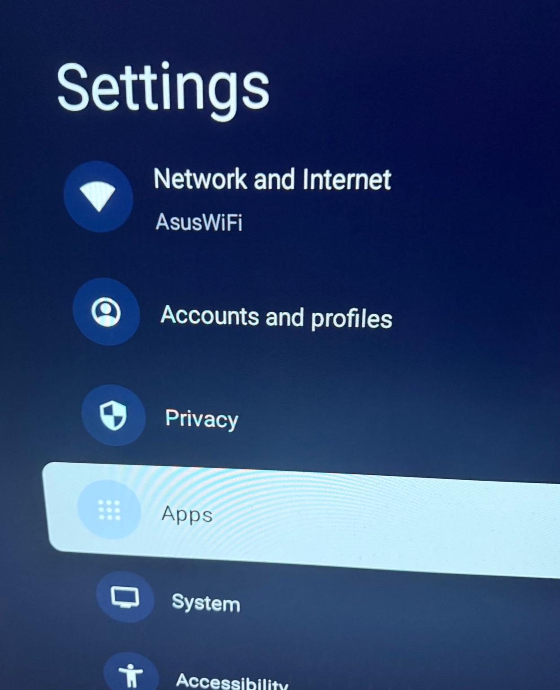
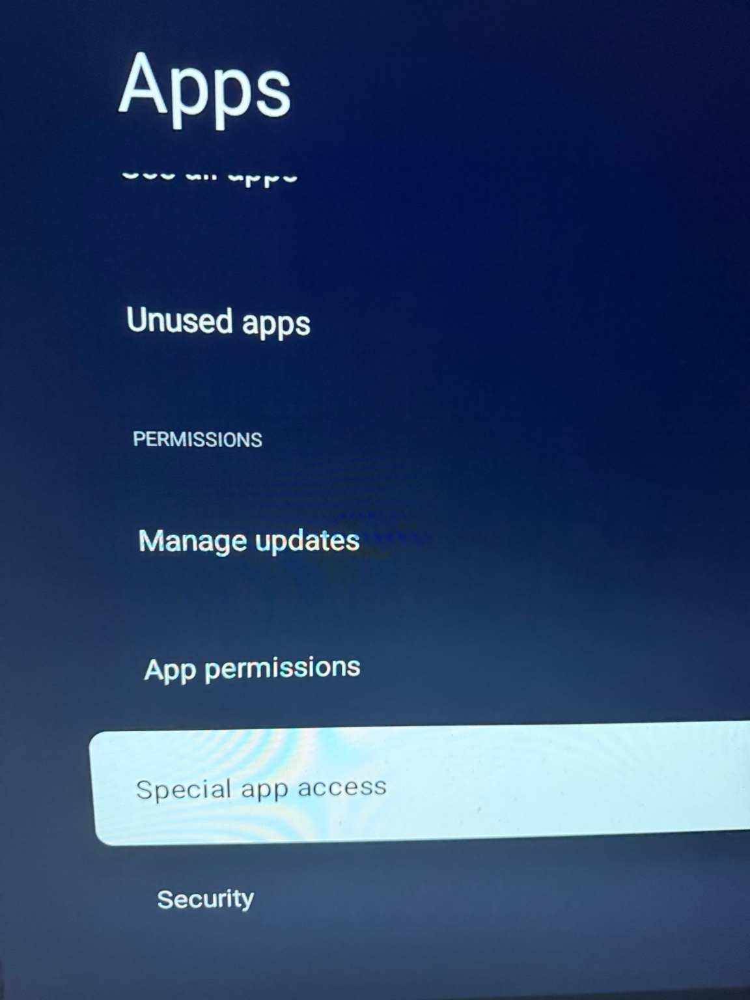
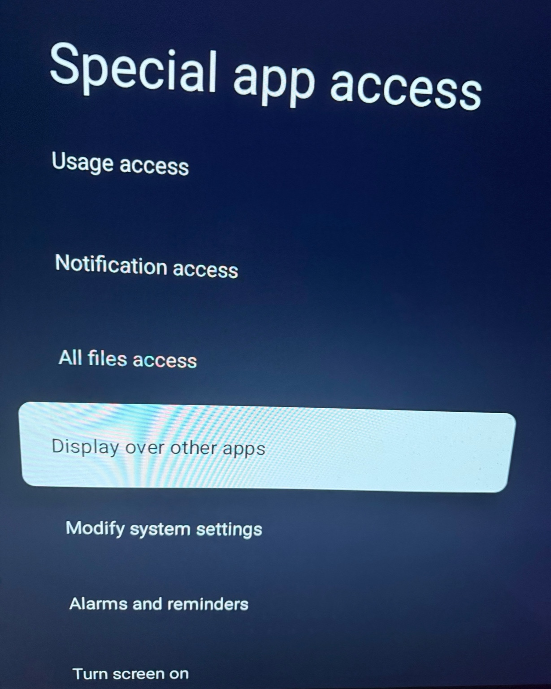
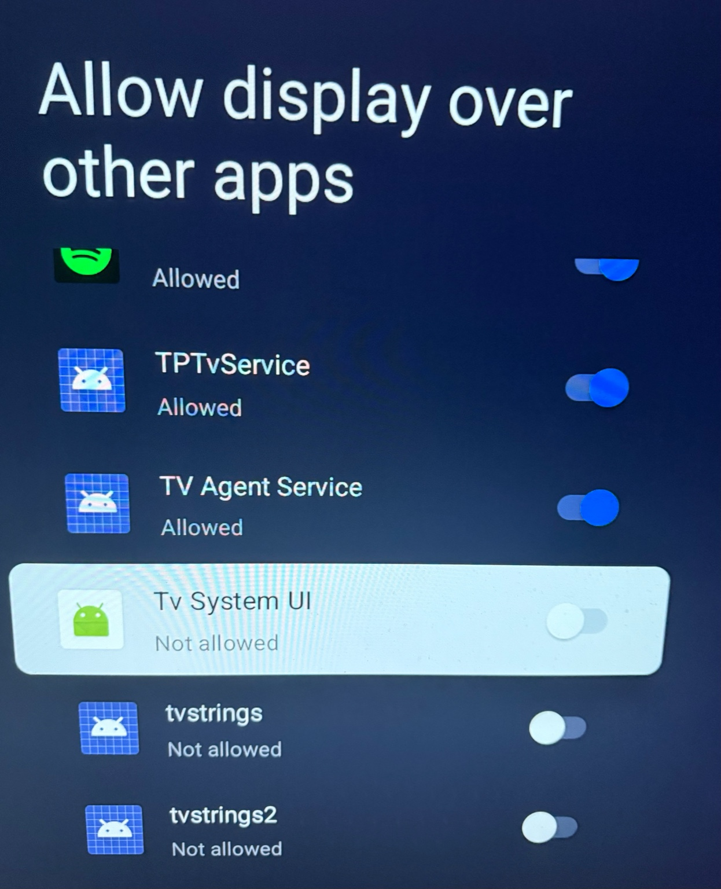

# Disable the Philips built-in screen saver (Philips Android TV)

This guide shows how to stop the Philips **system screensaver/overlay** from appearing on top of HDMI sources or apps by changing a single permission.

> This disables the Philips overlay only. If you also use the Google/Android “Screen saver / Ambient Mode,” see the optional step at the end.

---

## Steps (starting from **All settings**)

1. Go to **Settings → Apps**.  
   

2. Select **Special app access**.  
   

3. Open **Display over other apps**.  
   

4. In the list, locate **Tv System UI** and set it to **Not allowed** (toggle **OFF**).  
   

   - Leave **TPTvService** and **TV Agent Service** as they are; they’re unrelated to the overlay.  
   - It’s normal to see items like **tvstrings** / **tvstrings2** already set to *Not allowed*.

That’s it — the Philips overlay screensaver will no longer display over other apps/inputs.

---

## Optional: also disable Google/Android “Screen saver / Ambient Mode”

If you don’t want any screensaver at all:

- Go to **Settings → System (or Device Preferences) → Screen saver / Ambient Mode**  
  - Set **Screen saver** to **None/Off**, *or*  
  - Set **When to start** to **Never**.

*(Menu names vary slightly by software version.)*

---

## How to revert

If you later want the Philips overlay back:

- Return to **Settings → Apps → Special app access → Display over other apps**, then set **Tv System UI** to **Allowed**.

---

## Troubleshooting

- **Don’t see “Tv System UI”?** Reboot the TV and check again; on some builds it appears only after first opening **Display over other apps**.  
- **Other overlays missing (e.g., volume toasts)?** Re-enable **Tv System UI** (set to **Allowed**).  
- **After an update it came back.** Major firmware updates can reset this permission—repeat the steps above.

---

*Tested on recent Philips Android TV builds. Exact wording may vary slightly by model/firmware.*
